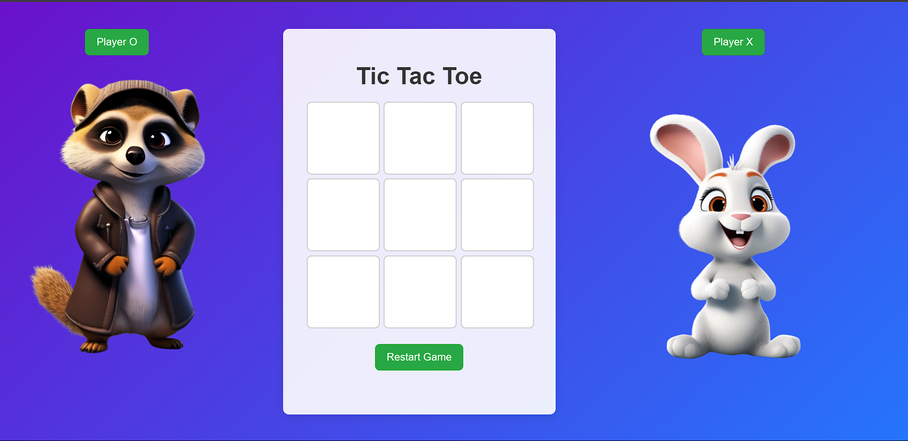

# Tic-Tac-Toe-Game
🕹️ Tic Tac Toe Game
A simple and interactive Tic Tac Toe game built using HTML, CSS, and JavaScript. This game supports two players (Player O and Player X), shows turn-based interaction, and highlights the winner with animated effects.
🧠 Features
🎮 Two-player mode (Player O vs Player X)

✅ Turn-based logic

🧠 Winner detection using classic 3-in-a-row algorithm

✨ Zoom effect on current player's image

🏆 Winner image stays zoomed after game ends

🔁 Restart button to reset the game

⚡ Smooth animations with CSS transitions

🛠️ Tech Stack
HTML5 – Markup for game layout

CSS3 – Styling and responsive layout

JavaScript (Vanilla) – Game logic and interactivity

📂 Project Structure
tic-tac-toe/
│
├── index.html          
├── style.css
├── first.js            
└── images/
    ├── one1.png        
    └── two.jpeg       
🧩 How to Play
Open index.html in your browser.

Click on the grid to place your symbol (O or X).

First player to align 3 symbols (row, column, or diagonal) wins.

Click Restart Game to play again.

🔧 How to Run Locally
# 1. Clone the repository
git clone https://github.com/your-username/tic-tac-toe.git

# 2. Open the folder
cd tic-tac-toe

# 3. Open in browser
Open index.html with any browser

📸 Screenshots

✨ Future Improvements
🎨 Add animations on win line

🔊 Add sound effects

📱 Make fully mobile responsive

💾 Save scores across sessions
